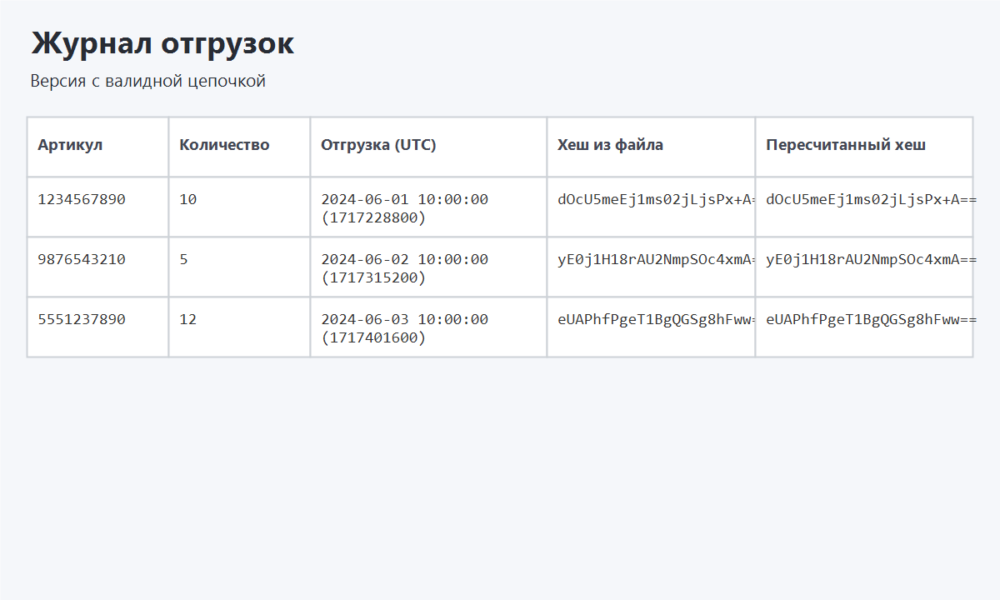
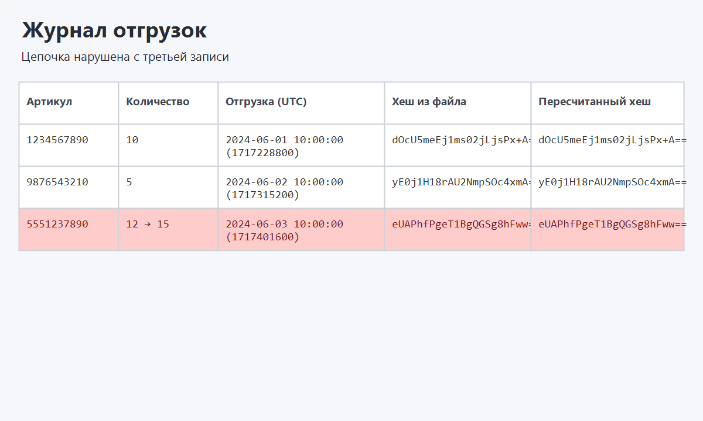

# 211_331_Karpov

## Описание
Приложение Qt отображает журнал отгрузок в адаптивной сетке `QGridLayout`, пересчитывает цепочку MD5 для каждой записи и подсвечивает нарушенные элементы красным цветом. Данные могут поступать из обычных JSON-файлов либо из ciphertext, зашифрованных алгоритмом AES-256-CBC и закодированных в Base64. Дополнительно внедрены средства защиты: обнаружение присоединённого отладчика через системные API Windows и периодическая проверка контрольной суммы сегмента `.text` в виртуальной памяти.

## Сборка
1. `cmake -S . -B build`
2. `cmake --build build`
3. Запустите `build/211_331_Karpov.exe`

Необходимо установить Qt 6 с модулем Widgets и компилятор, поддерживающий стандарт C++17.

## Работа с данными
- При старте загружается файл `data/transactions_valid.json.enc`.
- Кнопка «Открыть» позволяет выбирать как открытые `.json`, так и зашифрованные `.enc`.
- Для демонстрации ошибок подготовлен `data/transactions_corrupted.json.enc`, где третья запись нарушает цепочку.

## Защита
- Модуль `security/securitymanager.cpp` отслеживает попытки отладки (`IsDebuggerPresent`, `CheckRemoteDebuggerPresent`, `NtQueryInformationProcess`, `DebugActiveProcessStop`) и завершает приложение.
- Раз в три секунды вычисляется CRC32 сегмента `.text`; при несоответствии первоначальному значению пользователь получает предупреждение и процесс завершается.

## Скриншоты



## Шифрование файлов
Тестовые данные шифруются ключом AES-256 `ab9f5f69737f3f02f1e2a6d17305eae239f2bba9d6a8ed5e322ad87d3654c9d8` и вектором IV `1af38c2dc2b96ffdd86694092341bc04`. Скрипт PowerShell `data/encrypt.ps1` позволяет повторить процедуру шифрования для любых обновлённых JSON-файлов.

## Генерация данных
Для автоматического подсчёта хеш-цепочки и шифрования входит консольный инструмент:

```
cmake --build build --target transactions_tool
build/Desktop_Qt_6_5_3_MinGW_64_bit-Debug/transactions_tool.exe
```

Утилита последовательно запрашивает артикул, количество и unix timestamp, рассчитывает `hash_i = MD5(article_i + quantity_i + timestamp_i + hash_{i-1})`, сохраняет результирующий JSON и зашифрованный `.json.enc` файл рядом с исполняемым файлом.
